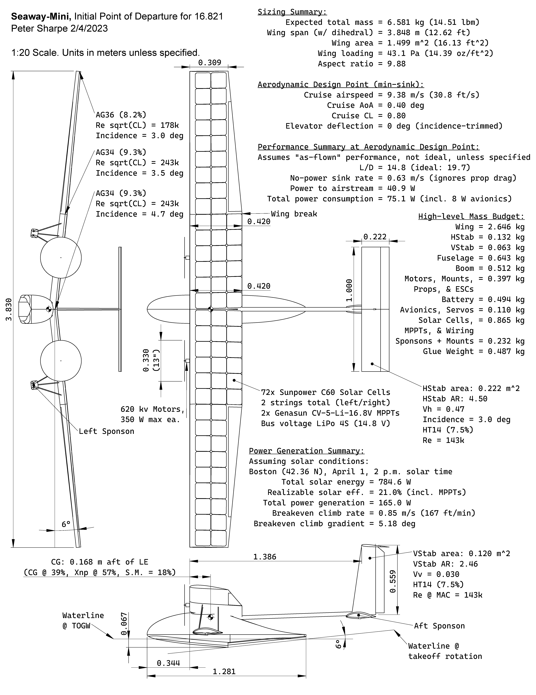
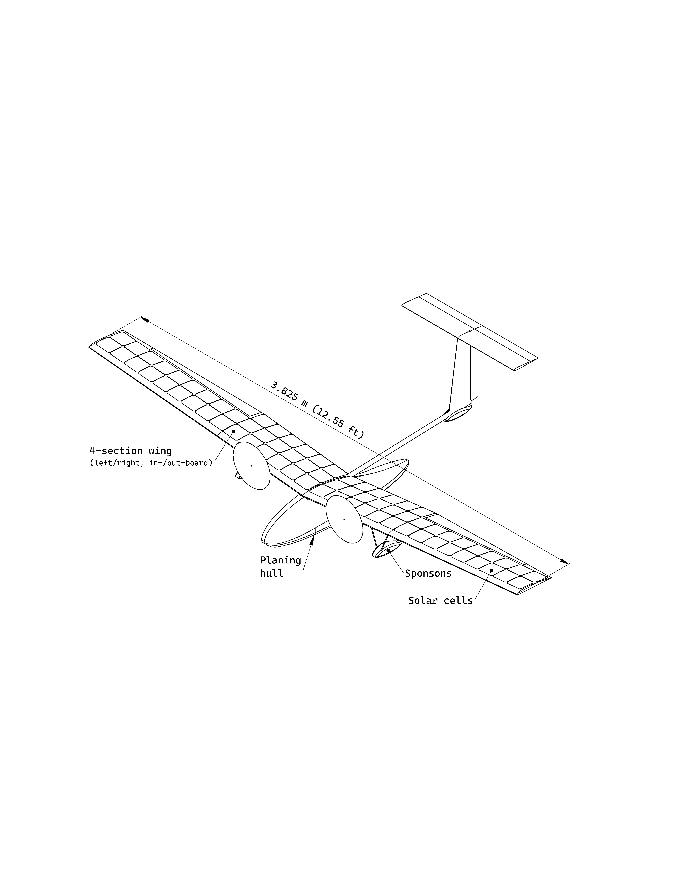
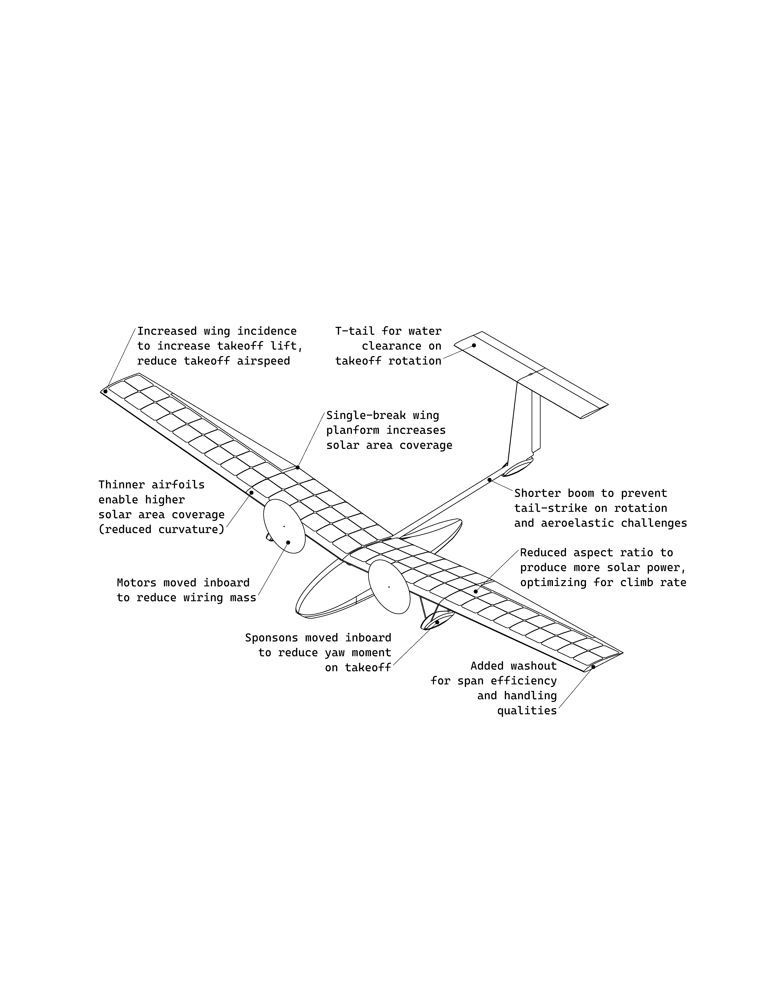
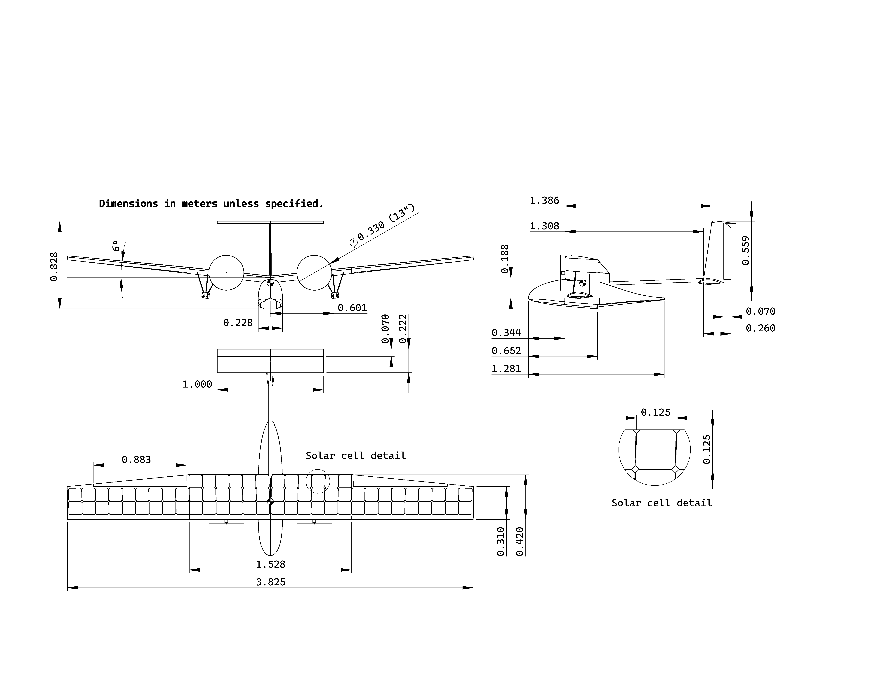
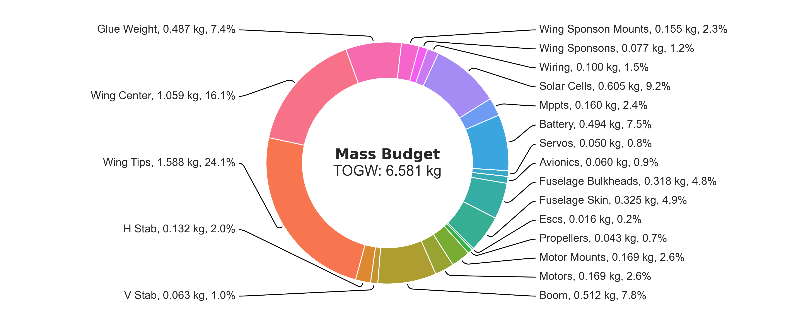

# Solar Seaplane Conceptual Design

Peter Sharpe

-----

**[UPDATE: See a video of the first flight here!](https://www.youtube.com/watch?v=snPPF-QjMSQ&t=50s)**

This repository contains a conceptual design for a small-scale (13 ft. wingspan) solar-electric seaplane. It was produced as part of my teaching for the class MIT 16.821: Flight Vehicle Development, a senior capstone course that covers aircraft detail design and manufacturing. Using this conceptual design as a point of departure, the students will detail-design and build an airplane aiming to demonstrate net-energy-positive daytime flight and water operations.

A more detailed description is available in [the PowerPoint deck of my kickoff lecture](./Point%20of%20Departure.pptx).

The CONOPS and several features of this airplane are similar to an airplane developed by our seniors during Fall 2022 for our companion course 16.82, which is the "design" half of our class. 

To run:

- Install Python 3.8+, ideally through Anaconda or Miniconda distribution (https://www.anaconda.com/products/distribution)
- In command line, run: `pip install --upgrade aerosandbox[full]` to install all Python package dependencies.
- Run `python design_opt.py` to run the main design optimization code for a point design.
- Run `python span_sweep.py` to run the design space exploration code.
